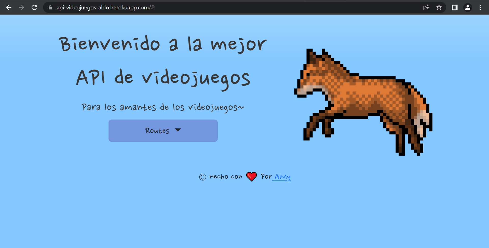

### General info
api-videojuegos-aldo es una REST API hecha para los amantes de los videojuegos. 

#### The Videojuego Object 🍵
| Properties    | Description                   | Type    |
|:-----------   |:---------------               |:--------|
|id             | el  id videogjuego            | String  | 
|image          | una image url                 | String  |
|description    | la descripcion                | String  | 
|comentarios    | comentarios del videojuego    | Arrat   | 

#### Routes ⚡
| Routes           | HTTP Methods     | Description
|:-------          |:---------------  |:--------------
| /videojuego      | GET              | Muestra todos los videojuegos
| /videojuego      | POST             | Crea un nuevo videojuego
| /videojuego      | DELETE           | Elimina todos los videojuegos
|/videojuego/:id   | GET              | Muestra un videojuego en especifico mediante su ID
|/videojuego/:id   | POST             | Agrega comentarios a un videojuego en especifico mediante su id
|/videojuego/:id   | DELETE           | Elimina un videojuego en especifico mediante su ID
	
### Technologies
Proyecto creado con:

   

* Node version: 12.14.1
* Express version: 4.17.1
* Mongoose version: 5.9.25 
* Multer version: 1.4.2 
* MongoDB Atlas

[VISITA MI API-VIDEOJUEGOS-ALDO HACIENDO CLICK AQUI!!!](https://api-videojuegos-aldo.herokuapp.com/#)